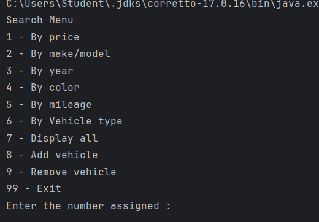
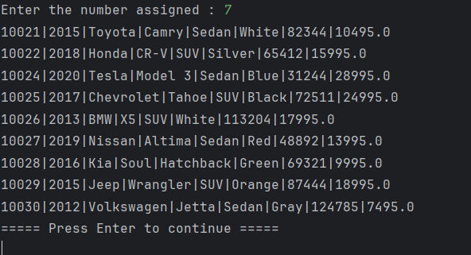
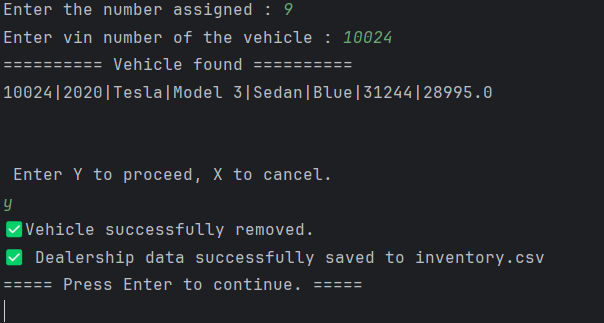

# 🧾 Accounting Ledger App

The **Dealership Inventory App** is a simple Java console-based program that allows users to manage a car dealership’s inventory using CSV file storage.
It demonstrates strong object-oriented programming principles and practical Java concepts such as **file I/O, exception handling, encapsulation, and collections**.
---

## 🚀 Features

* **Load inventory from CSV file**
Automatically loads dealership info and all vehicle data from inventory.csv.

* **Search filters -**
Filter vehicles by : 
    * Price range
    * Make & model
    * Year range
    * Color
    * Mileage range
    * Vehicle type

* **Display all vehicles -**
View the entire inventory with formatted vehicle details.

* **Add or remove vehicles -**
Modify the current dealership list and save updates back to the CSV file.

* **Data persistence -**
All inventory changes are saved to inventory.csv using DealershipFileManager.

* **User-friendly interface -**
Console-based menu with input validation and “Press Enter to continue” pauses for navigation.

---

## 🧠 Concepts Used

This project demonstrates several **core Java concepts**:

* Object-Oriented Programming (OOP)
* Classes and Objects
* Constructors, Getters & Setters
* Arrays / ArrayLists
* Loops and Conditionals
* Exception Handling (`try`, `catch`, `throws`)
* File I/O (reading & writing transactions to a file)
* Scanner input for user interaction

---
## 🖥️ Screenshots

<p align="center">
  
</p>
<p align="center">
  
</p>
<p align="center">
  
</p>


## 🧩 Code Snippets

### 👇 Major process methods that run the core of the program.
```java     
public ArrayList<Vehicle> getAllVehicles(){
        return this.inventory;
    }

    public ArrayList<Vehicle> getVehiclesByPrice(double min, double max){
        ArrayList<Vehicle> result = new ArrayList<>();
        for(Vehicle v : inventory){
            double price = v.getPrice();
            if(price >= min && price <= max){
                result.add(v);
            }
        }
        return result;
    }
    public ArrayList<Vehicle> getVehiclesByMakeModel(String make, String model){
        ArrayList<Vehicle> result = new ArrayList<>();
        for(Vehicle v : inventory){
            String vehicleMake = v.getMake();
            String vehicleModel = v.getModel();
            if(make.equalsIgnoreCase(vehicleMake) && model.equalsIgnoreCase(vehicleModel)){
                result.add(v);
            }

        }
        return result;
    }
    public ArrayList<Vehicle> getVehiclesByYear(int min, int max){
        ArrayList<Vehicle> result = new ArrayList<>();
        for(Vehicle v : inventory){
            int year = v.getYear();
            if(year >= min && year <= max){
                result.add(v);
            }
        }
        return result;
    }
    public ArrayList<Vehicle> getVehiclesByColor(String color){
        ArrayList<Vehicle> result = new ArrayList<>();
        for(Vehicle v : inventory){
            String vehicleColor = v.getColor();
            if(color.equalsIgnoreCase(vehicleColor)){
                result.add(v);
            }
        }
        return result;
    }
    public ArrayList<Vehicle> getVehiclesByMileage(int min, int max){
        ArrayList<Vehicle> result = new ArrayList<>();
        for(Vehicle v : inventory){
            int mileage = v.getOdometer();
            if(mileage >= min && mileage <= max){
                result.add(v);
            }
        }
        return result;
    }
    public ArrayList<Vehicle> getVehiclesByType(String vehicleType){
        ArrayList<Vehicle> result = new ArrayList<>();
        for(Vehicle v : inventory){
            String type = v.getVehicleType();
            if(type.equalsIgnoreCase(vehicleType)){
                result.add(v);
            }
        }
        return result;
    }

    public Vehicle getVehicleByVin(int vin){
        Vehicle result = null;

            for(Vehicle v : inventory){
                if(vin == v.getVin()){
                    result = v;
                }
            }
        return result;
    }

    public void removeVehicle(Vehicle v){
            inventory.remove(v);
        System.out.println("✅Vehicle successfully removed.");
    }

```
## 🛠️ How to Run

### 1. Clone the repository

```bash
git clone https://github.com/iBel251/Accounting-Ledger-App.git
```

### 2. Open in your IDE

Open the folder in **IntelliJ IDEA**, **VS Code**, or any Java IDE.

### 3. Compile and run
Navigate to Main.java in src/main/java/com.capstone directory and run the program

---

## 💾 File Handling

All transactions are saved to a local text file (e.g., `enventory.csv`) so that data is **retained between sessions**.

---

## 📂 Project Structure

```
Car-dealership/
│
├── src/
│   └── main/java/pluralsight/
│       ├── Program.java
│       ├── UserInterface.java
│       ├── Dealership.java
│       ├── Vehicle.java
│       ├── DealershipFileManager.java
│       ├── Tools.java
│       
│
└── inventorycsv
```

---

## 🎯 Future Improvements

* More robust error handling and testing
* Build a GUI
* Improve file structure or switch to database storage
* Export filtered list into Excel files

---

## 👨‍💻 Author

**Imran Ahmed**
Java Developer | Passionate about learning clean and structured coding.

---
